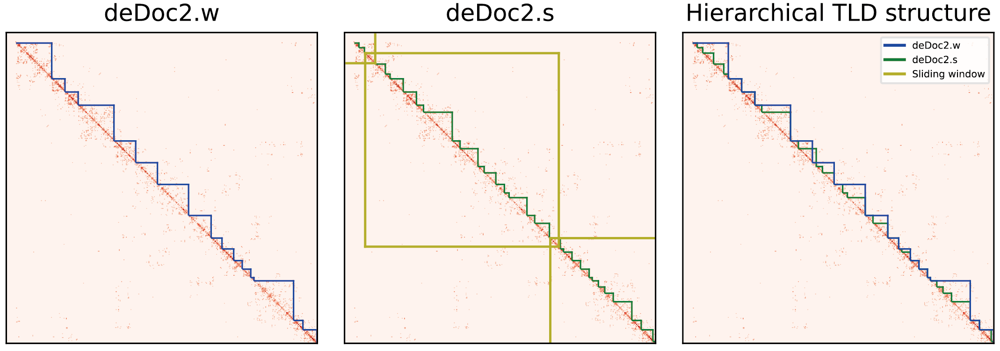

# deDoc2
## Introduction
deDoc2 is a TAD-like domain(TLD) prediction tool using structural information theory, it treats the Hi-C contact map as a weighted graph, 
and applys dynamic programming algorith to globally optimize the two-dimensional structural entropy of the graph partiton. 
The deDoc2 package consists of two predictors, deDoc2.w and deDoc2.s, to predict higher level, larger and lower level, smaller TLDs, respectively. 
The deDoc2.w minimizes the structural entropy in the whole Hi-C contact map, while the deDoc2.s minimizes the structural entropy in the matrices of sliding windows along the genome. 
We previously developed deDoc for bulk Hi-C TAD predicting at https://github.com/yinxc/structural-information-minimisation.



## Usage

Download the jar package deDoc2.jar, or you can also use the source code.

### Basic usage

deDoc2 relys on java environment.

java -jar deDoc2.jar [-inputfile file] [-sparseformat] [-binsize size] [-outputfile file] [-windowsize size] [-maxTLDsize size] 
[-rwr] [-rp rp] [-NDI] [-help]

`>> java -jar deDoc2.jar -inputfile ./exmaple/14.clean.con.chr18.matrix -binsize 40`

### Input Hi-C format

deDoc2 support both contact matrix format and sparse format as in deDoc.

- contact matrix format: n × n intra-chromosome contact matrix, tab split.

- sparse format: the first line is the number of bins, following lines are edges formed as from_bin to_bin edge_weight, space split.
```
1952
1 1 2.0
2 2 2.0
2 3 3.0
...
```

### Parameters

|Parameters|Required/Optional|Description|Default|
|----------|-----------------|-----------|-------|
|-inputfile|Required|input Hi-C data file path|N/A|
|-sparseformat|Optional|whether the input data is stored as sparse format|N/A|
|-binsize|Required|binsize of the input data (kb)|40kb|
|-outputfile|Optional|output file path and prefix|the same as inputfile|
|-windowsize|Optional|size of the sliding window in deDoc2.s (Mb)|10Mb|
|-maxTLDsize|Optional|max size of the predicted TLD (Mb), used to speed up deDoc2|10Mb|
|-rwr|Optional|whether to perform RWR imputation before TLD prediction|N/A|
|-rp|Optional|the restart probability of RWR imputation|0.5|
|-NDI|Optional|whether to calculate normalized decoding information (NDI), which can be used to determine binsize|N/A|
|-help|Optional|print help information|N/A|


### Output files

- file suffixed `.TAD` is the result of deDoc2.w, the higher level of TLD.
- file suffixed `.window.TAD` is the result of deDoc2.s, the lower level of TLD.
The output files contains partitions as TLD results. Each line represents a TLD, containg the node id of this TLD, space split, numbering from 1.
